# Guia dos gráficos

Explicação simples de cada gráfico gerado para comparar os 4 modos de RAG testados no LogiBot: **Sem RAG** (baseline, sem buscar material nenhum), **Context RAG**, **Self RAG** e **Hybrid RAG**. Em todos os gráficos, cada modo usa sempre a mesma cor:

🔵 Sem RAG &nbsp;&nbsp; 🟠 Context RAG &nbsp;&nbsp; 🟢 Self RAG &nbsp;&nbsp; 🟡 Hybrid RAG

Os grupos não têm o mesmo número de alunos (25 / 20 / 17 / 12, respectivamente) — isso é mencionado em cada gráfico onde faz diferença para a leitura.

---

## 📘 Desempenho de aprendizado (`quiz/`)

Métricas de quanto os alunos realmente acertaram no quiz de lógica de programação — o indicador mais direto de "esse RAG ajudou o aluno a aprender?".

### Acurácia no quiz por modo de RAG
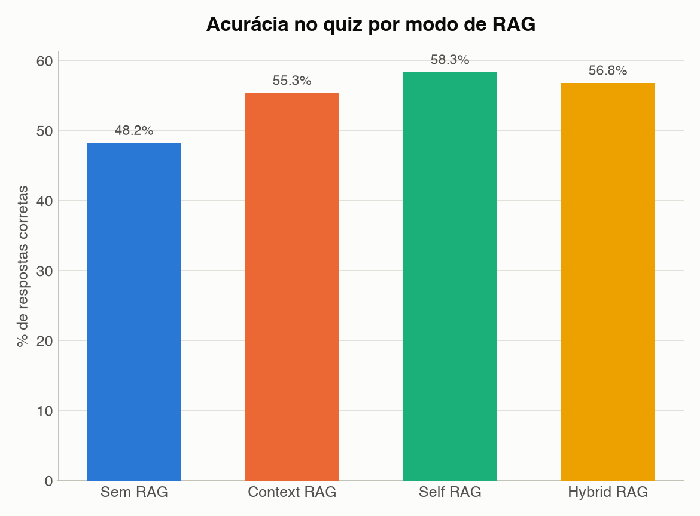

Mostra a % de respostas certas no quiz, somando todos os alunos de cada modo. É a métrica mais simples: de cada 100 perguntas respondidas, quantas o aluno acertou. Os 3 RAGs ficaram entre 55% e 58% de acerto, contra 48% do "Sem RAG" — ou seja, todos os RAGs ajudaram, e o **Self RAG** foi o que mais ajudou (58,3%).

### Acurácia por modo de RAG e assunto
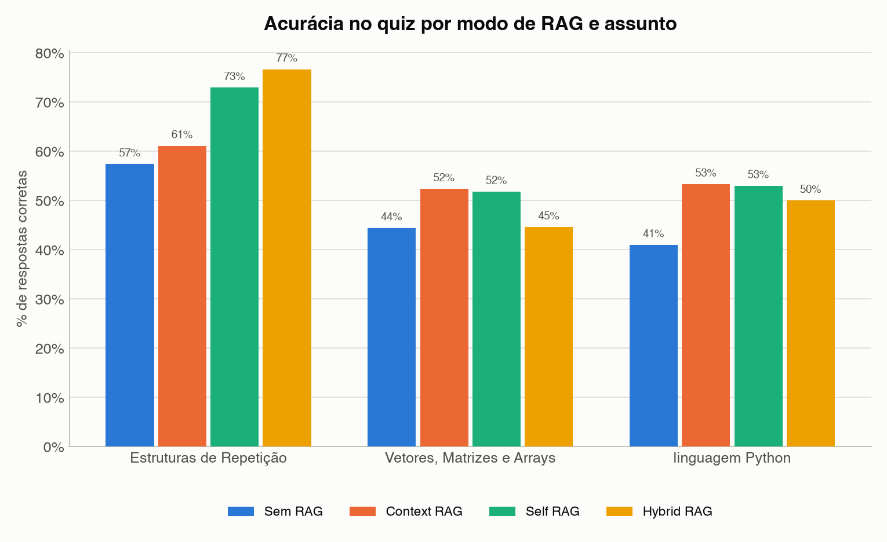

O mesmo % de acerto, mas separado pelos 3 assuntos cobrados no quiz (Estruturas de Repetição, Vetores/Matrizes/Arrays e linguagem Python). Serve para ver se algum RAG é bom "no geral" ou só se destaca em um assunto específico.

### Acurácia por modo de RAG e dia de teste
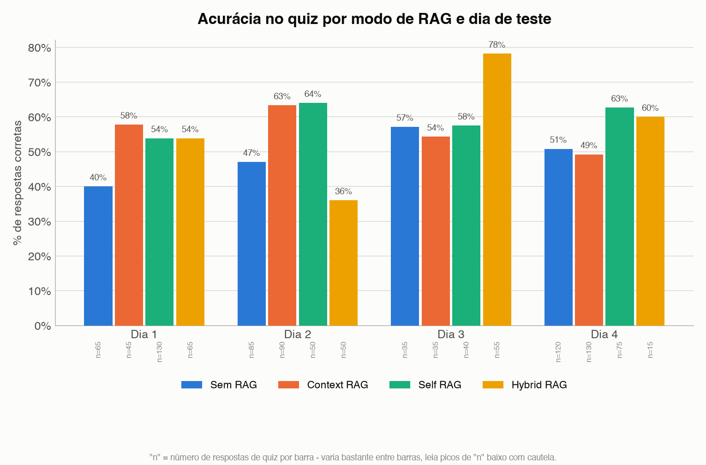

O % de acerto repetido para cada um dos 4 dias de teste (Dia 1 e 2 = Gaspar Viana, Dia 3 e 4 = IFPA). É o gráfico que mostra se um resultado é **consistente** (o RAG ganha em quase todo dia) ou se foi só sorte de um dia específico — por exemplo, o Hybrid RAG dispara no Dia 3, mas isso pode ser porque o grupo daquele dia era menor ou mais forte, não necessariamente porque o RAG ficou melhor.

### Respostas corretas vs incorretas por modo de RAG
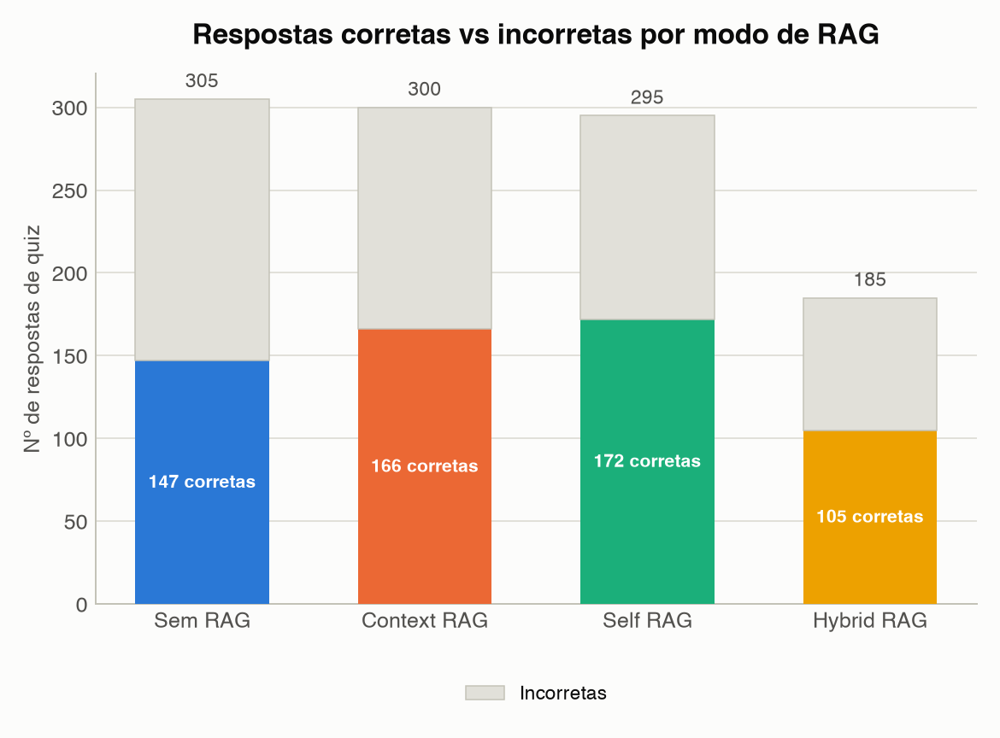

Em vez de %, mostra o número absoluto de respostas certas e erradas de cada grupo. Útil para lembrar que os grupos têm tamanhos diferentes: o "Hybrid RAG" teve só 185 respostas no total (grupo menor) contra 305 do "Sem RAG", então olhar só o número bruto pode enganar — é sempre bom olhar esse gráfico junto com o de %.

---

## 💬 Uso da plataforma (`engajamento/`)

Métricas de quanto os alunos efetivamente usaram o chat — não avalia se aprenderam, mas se ficaram engajados conversando com a IA.

### Tempo médio de chat por modo de RAG
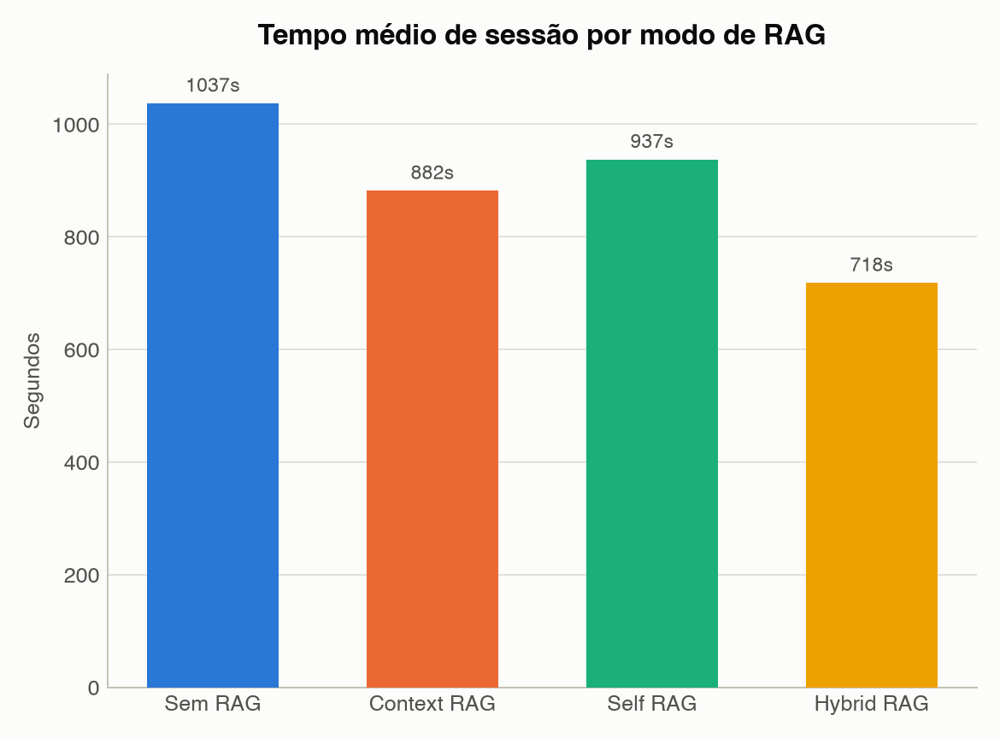

Para cada aluno que usou o chat, mede o tempo entre a primeira e a última mensagem daquela sessão, e tira a média do grupo (só entre quem realmente conversou — o número de alunos usado em cada barra está escrito embaixo dela, como "n=19"). **Atenção**: esse tempo não desconta quando o aluno ficou com a aba aberta sem fazer nada — então um único aluno que demorou horas para mandar a segunda mensagem "infla" a média do grupo dele inteiro. É por isso que "Sem RAG" aparece tão alto (394 min): não é que os alunos passaram 6h e meia conversando, é que pelo menos um deles deixou a conversa aberta por muito tempo. Leia esse gráfico com cautela.

### Mensagens médias por aluno, por modo de RAG
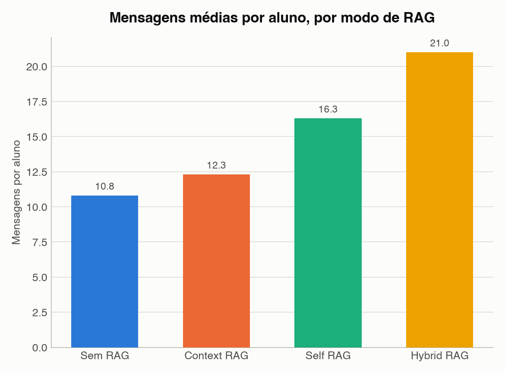

Quantas mensagens (do aluno + da IA somadas) cada aluno trocou, em média, dentro de cada grupo. É um indicador de engajamento mais confiável que o tempo, porque não depende de "quanto tempo a aba ficou aberta" — reflete quanto o aluno efetivamente interagiu. O Hybrid RAG teve a maior média (21 mensagens/aluno), o "Sem RAG" a menor (10,8).

### Nº de alunos ativos por modo de RAG e dia de teste
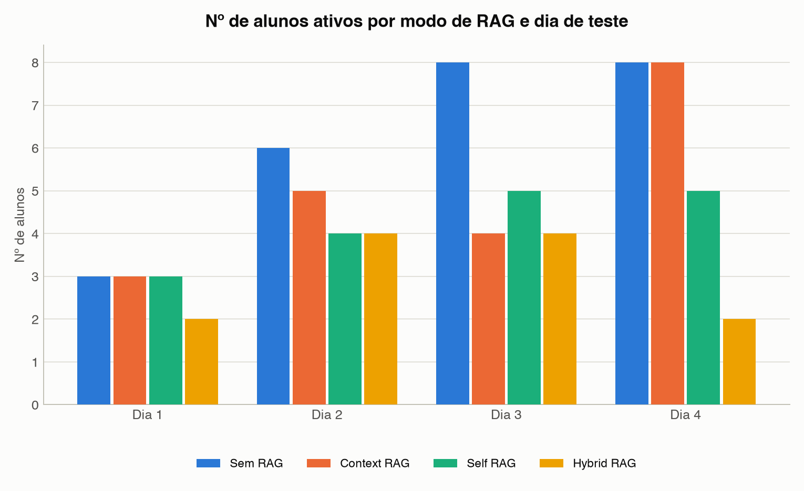

Não é bem um resultado — é o "tamanho da amostra" de cada grupo, em cada dia. Serve de referência para os outros gráficos: um grupo com poucos alunos (como o Hybrid RAG, com só 12 no total) tem uma média mais fácil de ser puxada por um único aluno fora da curva, então resultados desse grupo merecem um pouco mais de cautela do que os de um grupo com 25 alunos.

---

## 🤖 Comportamento do RAG (`comportamento_rag/`)

Métricas técnicas de como cada modo de RAG efetivamente funcionou por trás das respostas — não medem aprendizado, medem o "motor" do RAG.

### Taxa de recuperação de contexto por modo de RAG
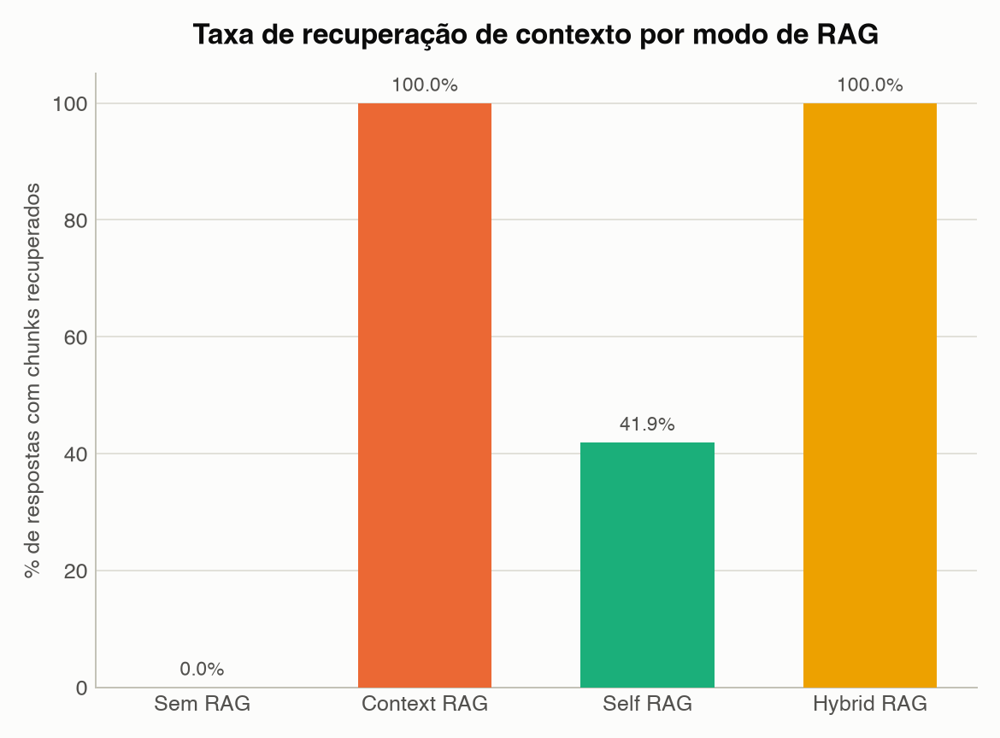

De todas as respostas que a IA deu, em quantas ela foi buscar um trecho de material de apoio (PDF/livro) antes de responder. Por definição, "Sem RAG" é sempre 0%. "Context RAG" e "Hybrid RAG" buscam material em **toda** resposta (100%). Já o "Self RAG" é o único que decide sozinho quando vale a pena buscar — e escolheu buscar em só 42% das respostas, confiando no próprio conhecimento da IA no restante.

### Score médio de recuperação por modo de RAG
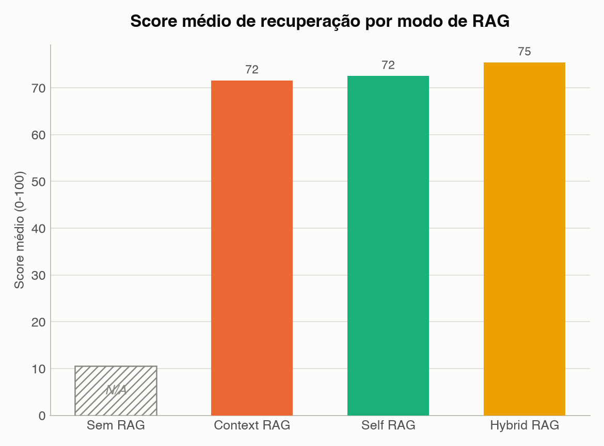

Quando o RAG buscou um trecho de material, esse trecho vinha com uma nota de 0 a 100 dizendo o quão relevante ele era para a pergunta do aluno (calculada pelo próprio sistema de busca). O gráfico mostra a média dessa nota — quanto maior, mais "relevante" era o material que a IA estava usando para montar a resposta. "Sem RAG" não aparece aqui, porque nunca busca nada.

### Tempo médio de resposta por modo de RAG
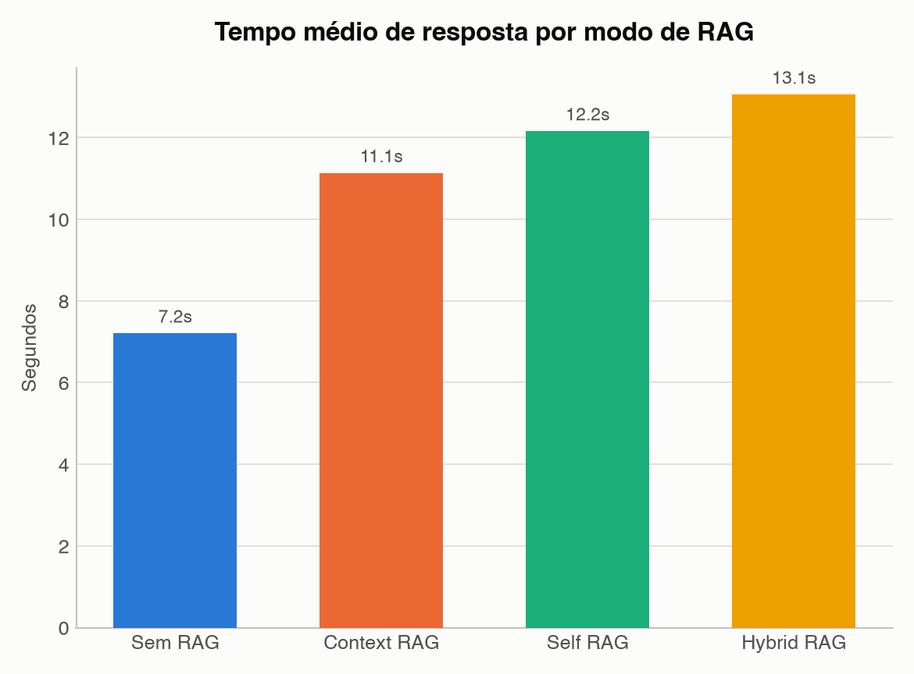

Quantos segundos a IA demorou, em média, para gerar cada resposta. Faz sentido que "Sem RAG" seja o mais rápido (não perde tempo buscando material) e que "Hybrid RAG" seja o mais lento (13 segundos) — ele combina mais de uma estratégia de busca antes de responder, o que custa tempo extra.

### Tokens médios por resposta, por modo de RAG
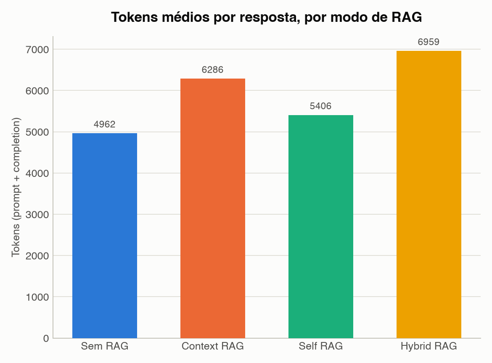

"Token" é a unidade que a IA usa para processar texto (aproximadamente um pedaço de palavra). Esse número soma o texto que entrou (pergunta + material recuperado) com o texto que a IA gerou como resposta, em média por resposta. Grupos com RAG usam mais tokens porque o material recuperado entra junto na "leitura" da IA antes dela responder — o "Sem RAG" usa bem menos (só a pergunta do aluno) do que o "Hybrid RAG", que injeta mais contexto.

---

## Resumo: o que cada modo ganhou e perdeu

| Modo | Acerto no quiz | Engajamento (mensagens) | Busca material? | Velocidade de resposta |
|---|---|---|---|---|
| **Sem RAG** | Pior (48,2%) | Menor (10,8 msg/aluno) | Nunca | Mais rápido (7,2s) |
| **Context RAG** | Bom (55,3%) | Médio (12,3 msg/aluno) | Sempre (100%) | Médio (11,1s) |
| **Self RAG** | Melhor (58,3%) | Alto (16,3 msg/aluno) | Só quando decide (41,9%) | Médio-lento (12,2s) |
| **Hybrid RAG** | Bom (56,8%) | Maior (21,0 msg/aluno) | Sempre (100%) | Mais lento (13,1s) |

Em resumo: qualquer RAG supera não usar RAG na hora de acertar o quiz. O **Self RAG** teve o melhor equilíbrio (melhor acerto, bom engajamento, sem gastar tempo/tokens buscando material toda vez). O **Hybrid RAG** teve o maior engajamento, mas ao custo de ser o mais lento e mais caro em tokens — e seu grupo era o menor (12 alunos), então esse resultado merece ser confirmado com mais dados antes de virar conclusão definitiva.
